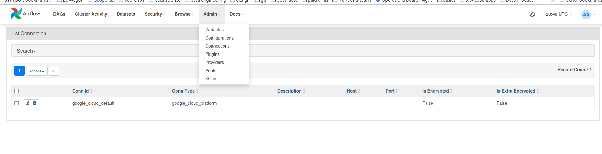
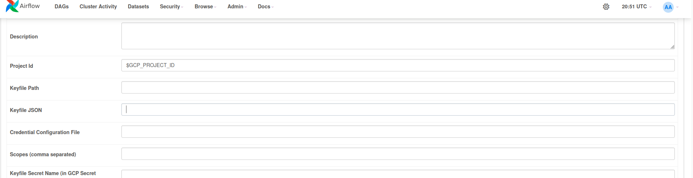

# 🛠️ Technical Notes

### 📌 Purpose
This document serves as a reference for resolving technical issues. You can keep adding more troubleshooting steps as needed.

---

## Setting Up `google_cloud_default` Connection in Airflow

Follow these steps to configure the **Google Cloud default connection** in Airflow when running with Docker Compose:

### 1. Start Docker Compose
Ensure your Airflow instance is running with Docker Compose:
```sh
docker-compose up -d
```

### 2. Add the Connection via CLI
Run the following command in your terminal to add the **google_cloud_default** connection:

```sh
docker exec -it cgpdata-scheduler airflow connections add google_cloud_default \
--conn-type google_cloud_platform \
--conn-extra '{"extra__google_cloud_platform__keyfile": "${GCP_KEY_FILE}",
"extra__google_cloud_platform__project": "${GCP_PROJECT_ID}"}'
```


### 3. Configure in Airflow UI
1. Navigate to **Airflow UI** → **Admin** → **Connections**.
2. Locate and select the `google_cloud_default` connection.
3. Open the connection settings and **paste the contents** of your `key.json` file into the appropriate field.
4. Click **Save**.





---
